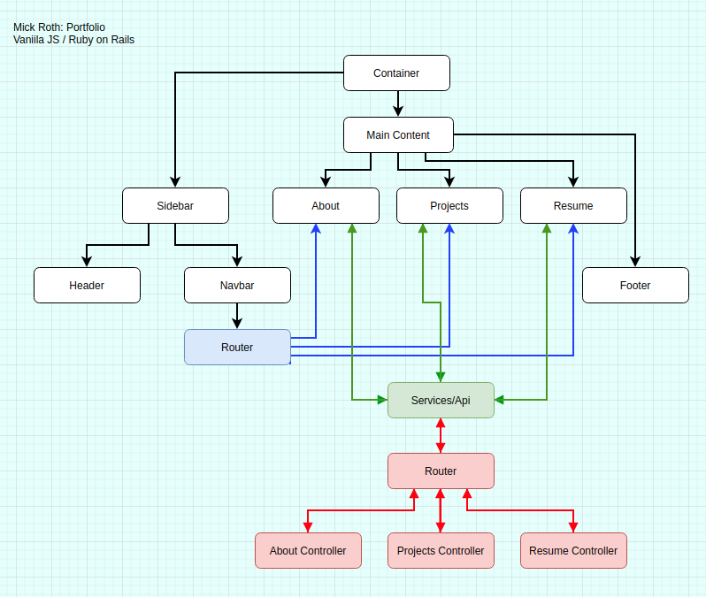
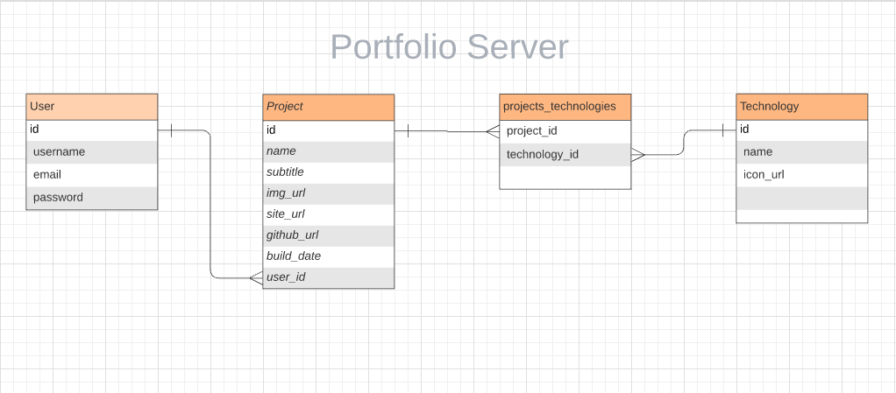

***Mick Roth***

# Portfolio

This is a personal portfolio demonstrating projects.

It is built with vanilla Javascript and a [Rails backend](https://portfolio-server-mick.herokuapp.com)
 

### &#127803; Technologies	
- Javascript
- Webpack
- Sass
- Font-Awesome
   
- Ruby on Rails
- Postgresql
- BCrypt
- JWT
- Heroku
  

 

### &#x1F3E1; Deployed
- [Current Site](https://mickroth.com)

- [2.1](https://mick-roth.surge.sh)
- [2.0](https://mickroth.surge.sh)
- [1.0]()

### &#127803; Flow Chart

  
 

 
### &#127803; ERD

  
 

 

### &#x1F3E3; Backend
- [Current (heroku)](https://portfolio-server-mick.herokuapp.com)
- [Old Version](https://github.com/mickmed/portfolio-server-old)
 

